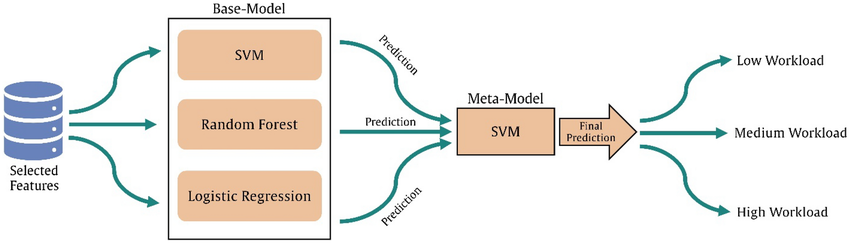

# Multi-Class-Prediction-of-Cirrhosis-Outcomes

## Overview

In this Playground Series - Season 3, Episode 26 on Kaggle, we seek to build a model that predict the probability of a patient's disease using many features.

## Table of Contents

- [Multi-Class Prediction of Cirrhosis Outcomes](#Multi-Class Prediction of Cirrhosis Outcomes)
  - [Overview](#overview)
  - [Table of Contents](#table-of-contents)
  - [Dependencies](#dependencies)
  - [Model Architecture](#model-architecture)
  - [Results](#results)
  - [Issues and Future Improvements](#issues-and-future-improvements)

## Overview

As always, the primary objective is to create a model, whether in white-box or black-box fashion, that minimizes the loss on the test dataset. To initiate the process, my initial focus was on cleaning the data. This involved handling missing values and converting all data to numerical format.

The data preprocessing culminated in the utilization of One-Hot Encoding for all features, a strategy known for its effectiveness in enhancing model performance by representing categorical variables in a numerical format.

## Dependencies
I chose to leverage PyCaret, a comprehensive library that performs model comparison and ranking for numerous state-of-the-art models based on your dataset. Additionally, I incorporated Optuna, a recently discovered library designed for optimizing and fine-tuning my model's hyperparameters. This combination allows for efficient model selection and hyperparameter optimization, streamlining the process of developing a high-performing machine learning model without delving into the details of other common libraries such as sklearn, scipy, matplotlib, seaborn, etc.

## Model Architecture
I chose stacking, a widely used machine learning model architecture that combines heterogeneous models. Stacking involves training a meta-learner, another model, which learns the optimal aggregating weights to minimize the stacking model's performance on the training dataset. This meta-learner is responsible for efficiently combining predictions from diverse base models to improve overall predictive accuracy.



## Result

As you can see, I ranked top 38% up-to-day

## Issues and Future Improvements

```plaintext
Numerous approaches could be adopted to improve the accuracy of this model:
    - Avoid overfitting in The stacking layer by encorporating Regularization
    - Feature engineering
    - hyperparameter optimization using optuna
    - eventually using a NN
```